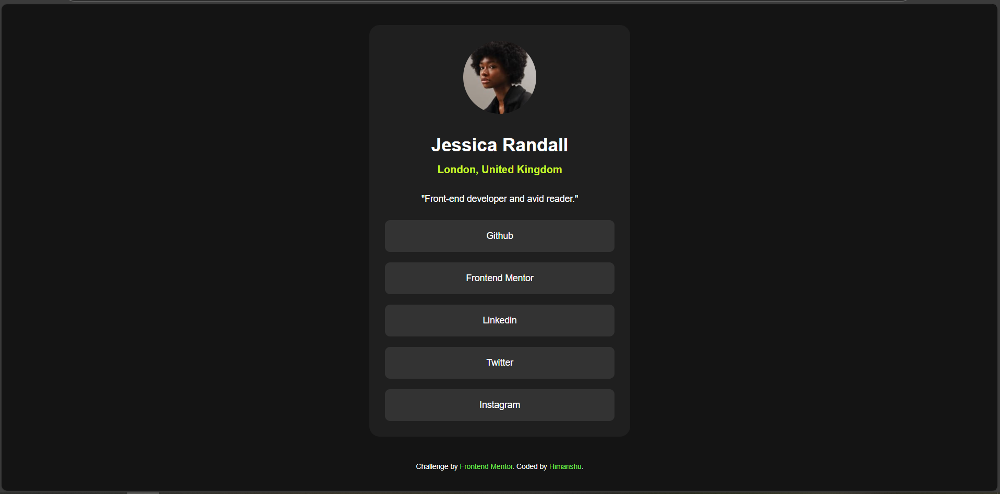

## Welcome! 👋

Thanks for checking out this front-end coding challenge.

[Frontend Mentor](https://www.frontendmentor.io) challenges help you improve your coding skills by building realistic projects.

This is the solution to the [Social Links Profile Challenge from Frontend](https://www.frontendmentor.io/learning-paths/getting-started-on-frontend-mentor-XJhRWRREZd/steps/672232a65832c087f2010131/challenge/start)

In this challenge I've to build out this blog card component and get it looking as close to the design as possible.

And i've buit it like this:

**Having fun in building!** 🚀
